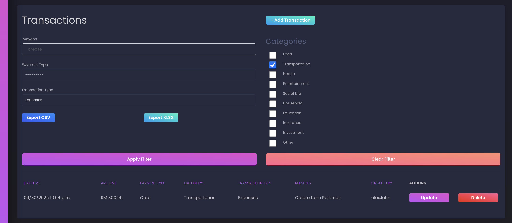

## Usage (step by step)

- 1. Once you've able to runserver and head over to `http://127.0.0.1:8001/`, you'll need to first Register for an account by filling up the registration forms:

 

- 2. It'll redirect you to login page, fill it up based on your newly-created credentials and you should able to login to the dashboard:

 

- 3. To create a brand new Transaction, click on the `Add Transaction` button as you land on the Dashboard. Notice that the Dashboard's top layer display on your overall Income/Expenses will reflect accordingly.

 

- 4. Feel free to update or delete the Transactions as you wish. You can also filter the Transactions results based on the filter options, while generating either CSV or Excel (xlsx) sheet via both buttons:
> Suppose you want to generate reports based on some filtered results.
> First, fill up the input fields, then click on `Apply Filter` button, it should re-render the page with filtered results:

 

> So now, go ahead and click either on the csv/xlsx export buttons, you should see same filtered results in the downloaded files:

> If you want to reset the tables and view everything without those filters, just click `Clear Filter` button.

 

- 5. In mobile phone viewport, it should alter the tables by stacking the columns horizontally to fit the screen:

 

- 6. To look at an overview breakdown based on Category, you can also head over to the `CHARTS` section on left side menubar.

 

- 5. To logout, simply click on the `Logout` button on the left hand sidebar.

> Do note that each logged in user can only see his/her own data.

 

---

## API Documentations

- To view documentations for list of possible endpoints, you can click the `API` over within the system:

- You can also test these endpoints using `curl` on terminal, or using tools like Postman, as shown here:

---
